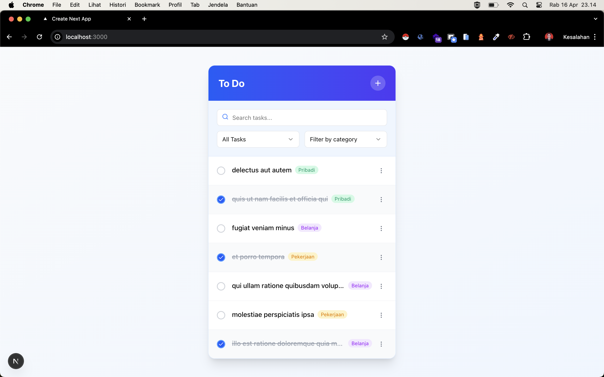

# Modern Todo List Application

A sleek, responsive Todo List application built with Next.js and React. This application features a modern UI with smooth animations, drag-and-drop functionality, filtering options, and real-time updates.

## Features

- ✅ **Task Management**: Create, update, delete, and mark tasks as complete
- 🔄 **Drag and Drop**: Reorder tasks with intuitive drag-and-drop functionality
- 🔍 **Advanced Filtering**: Filter tasks by status (all, active, completed) and categories
- 🔎 **Search**: Search through tasks with real-time results
- 📱 **Responsive Design**: Works seamlessly on desktop and mobile devices
- 🎨 **Modern UI**: Clean, intuitive interface with smooth animations
- 📊 **Categories**: Organize tasks with customizable categories
- ⚡ **Real-time Updates**: Instant UI updates with optimistic rendering

## Technologies Used

- **Frontend**:
  - [Next.js](https://nextjs.org/) - React framework
  - [React](https://reactjs.org/) - UI library
  - [Redux](https://redux.js.org/) - State management
  - [Redux-Saga](https://redux-saga.js.org/) - Side effect management
  - [React DnD](https://react-dnd.github.io/react-dnd/) - Drag and drop functionality
  - [Framer Motion](https://www.framer.com/motion/) - Animations
  - [Tailwind CSS](https://tailwindcss.com/) - Styling
  - [shadcn/ui](https://ui.shadcn.com/) - UI components

- **API Integration**:
  - [Axios](https://axios-http.com/) - HTTP client
  - [JSONPlaceholder](https://jsonplaceholder.typicode.com/) - Mock API

## Acknowledgments

- [JSONPlaceholder](https://jsonplaceholder.typicode.com/) for providing a fake REST API
- [shadcn/ui](https://ui.shadcn.com/) for the beautiful UI components
- [Tailwind CSS](https://tailwindcss.com/) for the utility-first CSS framework

## Screenshot To Do

